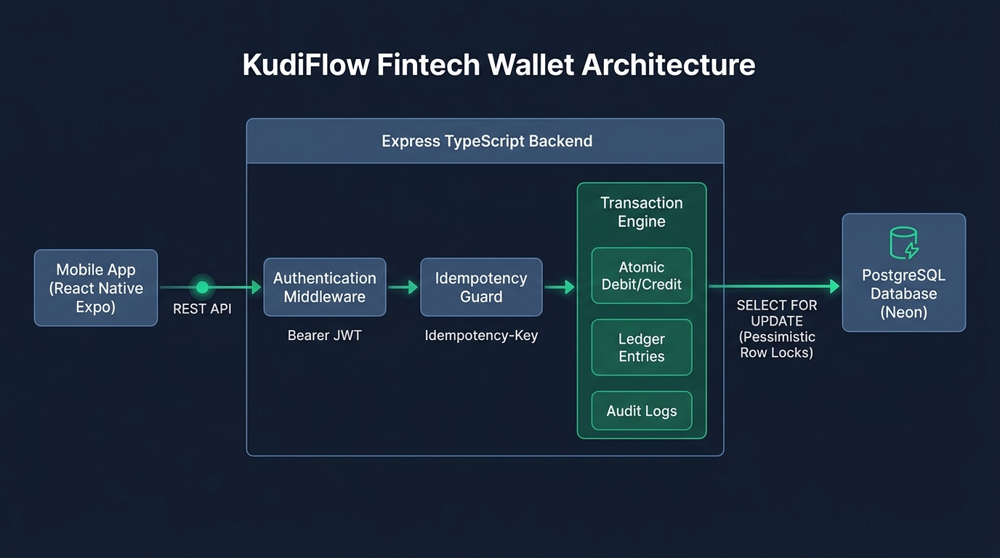
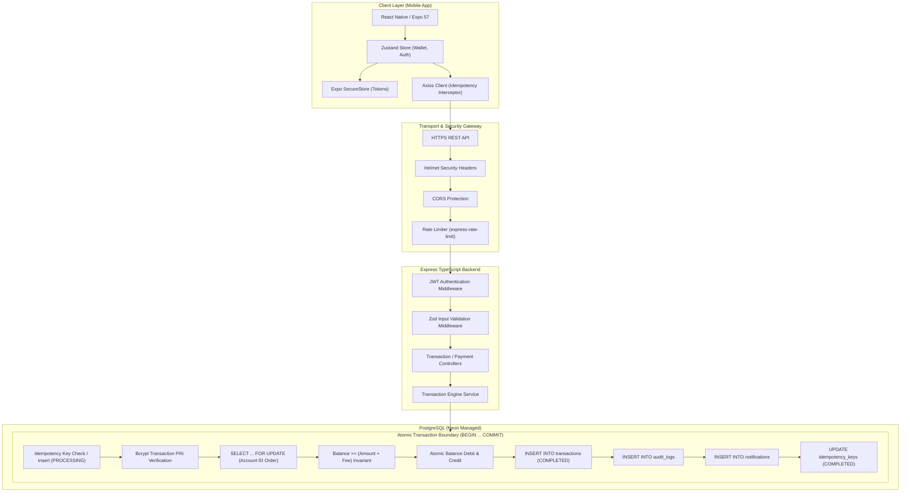
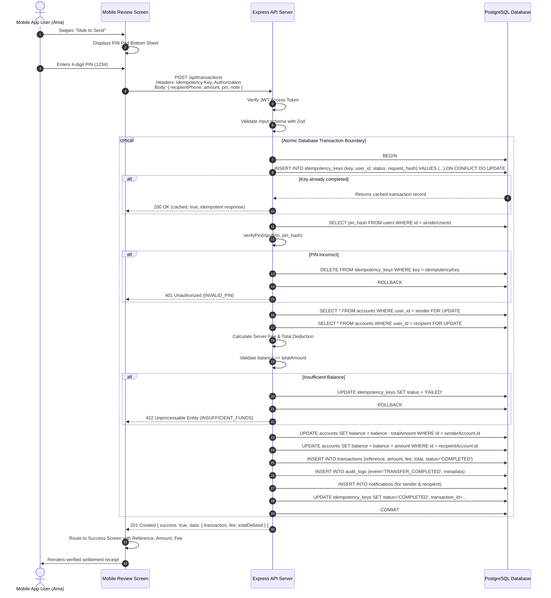

# KudiFlow System Architecture

> **Ghana-Context Digital Wallet Platform — Technical Challenge Prototype**

---

## 1. Overview & Architectural Principles

KudiFlow is engineered from the ground up as an **authoritative financial ledger**, not a conventional CRUD application. The system strictly isolates client interaction from financial decision-making: the client UI expresses *intent*, while the backend enforces *invariants*, calculates *fees*, locks *resources*, records *double-entry ledger movements*, and emits *tamper-evident audit logs*.

### Core Principles:
1. **Server-Authoritative Balances**: Balances are calculated, updated, and stored exclusively by the backend database. Client applications can never pass new balances or alter account balances directly.
2. **Strict Atomicity**: Debits and credits execute within a single PostgreSQL transaction (`withTransaction`). Either both accounts update successfully and the ledger entry is committed, or the transaction rolls back completely with zero partial money movement.
3. **Pessimistic Concurrency Control**: Accounts are locked using `SELECT ... FOR UPDATE` ordered by account ID to completely eliminate race conditions and avoid deadlocks during concurrent transfers.
4. **End-to-End Cryptographic Idempotency**: Every financial request requires a client-generated `Idempotency-Key` header with payload SHA-256 fingerprinting. Duplicate network transmissions return cached transaction receipts without re-debiting.
5. **Exact Decimal Precision**: All monetary values are calculated in integer pesewas (`toPesewas` / `fromPesewas`) and stored in PostgreSQL `NUMERIC(15,2)`. Floating-point arithmetic is prohibited.

---

## 2. High-Level Architecture Diagram

---

## 3. Layer Responsibilities

### 1. Mobile Client Layer (`mobile/`)
* **Framework**: React Native 0.86.3 with Expo 57 and Expo Router v57.
* **Responsibilities**:
  * Render pixel-perfect interactive flows (Onboarding, Login, Wallet Dashboard, Send Review, Interactive PIN Modal, Bill Pay, Payment Requests, and Transaction Details).
  * Generate a cryptographically random UUID v4 `Idempotency-Key` upon mounting a transaction intent.
  * Store JWT access tokens and refresh tokens in device hardware-backed storage (`expo-secure-store`).
  * Never compute final balances or fees locally; display solely server-authoritative numbers.

### 2. Transport & Security Middleware (`server/src/middleware/`)
* **`helmet`**: Sets HTTP security headers (`X-Content-Type-Options`, `X-Frame-Options`, `Strict-Transport-Security`).
* **`cors`**: Enforces strict origin matching for authorized web and mobile origins.
* **`express-rate-limit`**:
  * Global API: 100 requests / minute.
  * Auth endpoints: 10 requests / 15 minutes.
  * OTP endpoints: 3 requests / minute.
* **`auth.middleware.ts`**: Verifies HMAC-SHA256 JWT access tokens, validates user status in database, and injects authenticated user claims (`userId`, `phone`, `email`).
* **`validate.middleware.ts`**: Validates request body schemas against strict Zod type definitions before execution reaches business services.

### 3. Application Services Layer (`server/src/services/`)
* **`transaction.service.ts`**:
  * Coordinates atomic transfers, sandbox funding deposits, and utility bill payments.
  * Enforces server-side fee schedule:
    * Amounts $\le \text{GH₵ } 50.00$: **GH₵ 0.00** fee.
    * Amounts $> \text{GH₵ } 50.00$: **GH₵ 2.00** flat fee.
    * Bill payments: **GH₵ 1.00** flat convenience fee.
* **`payment-request.service.ts`**: Manages inbound and outbound peer-to-peer payment requests, settlement execution with PIN verification, and request cancellation/declination.
* **`auth.service.ts`**: Handles password hashing via `bcrypt` (cost factor 12), PIN hashing, JWT token rotation, and credential verification.
* **`otp.service.ts`**: Generates and hashes 6-digit one-time verification pins with attempt caps.

### 4. Persistence Layer (`server/src/config/database.ts` & PostgreSQL)
* **PostgreSQL Engine**: Neon Serverless PostgreSQL with SSL connection pooling.
* **Isolation Level**: Read Committed with explicit pessimistic row locks (`SELECT FOR UPDATE`).
* **Precision**: All financial columns use `NUMERIC(15,2)` and `CHECK` constraints prevent negative balances or corrupted ledger rows.

---

## 4. End-to-End Financial Transaction Sequence

---

## 5. Failure and Uncertainty Handling

* **Network Drop Before Submission**: Client generates a fresh idempotency key on first submit.
* **Network Drop During Processing**: Client retains the identical idempotency key on its screen state. If user retries, backend detects the in-flight or completed key and returns the identical response without charging again.
* **Database Deadlock Prevention**: When locking multiple accounts (sender and recipient), locks are always acquired in deterministic `account.id` order (`ID_A < ID_B`).
* **Crash Consistency**: Because all money movement occurs within a single database transaction, any unhandled error, database disconnect, or server crash triggers an automatic PostgreSQL rollback. Balance corruptions or partial debits are mathematically impossible.
